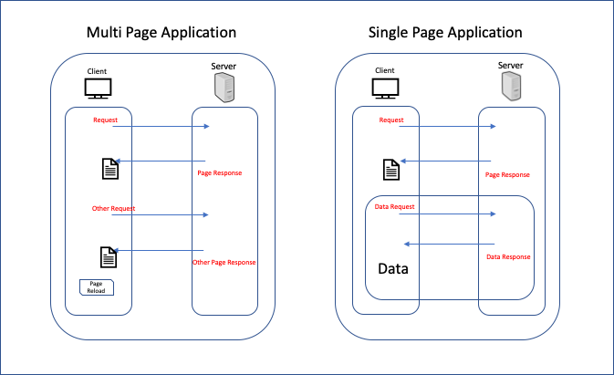

**20200927-섹션1.리액트 프로젝트 시작하기-SPA 만들기**

## MPA, SPA LifeCycle

---


## 멀티페이지 어플리케이션(multi page application-MPA)

- **클라이언트**가 **초기 요청**을 보낸다.
  - **서버**는 **HTML을 내려준다.**
- 이후 **클라이언트**에서 **페이지 전환 요청**을 보낸다.
  - **서버**는 또 다시 **HTML을 내려준다.**
  - **클라이언트**는 페이지를 **리로드** 한다.

## 단일페이지 어플리케이션(single page application-SPA)

- **클라이언트**가 **초기 요청**을 보낸다.
  - **서버**가 **HTML을 내려준다.(MPA 동일)**
- 이후 **클라이언트**에서 **페이지 전환 요청**을 보낸다.
  - **서버**로 **필요시에만 데이터 요청**
  - **페이지 전환은 자체적으로 라우팅 처리**

### SPA가 가능하기 위한 조건

- 자바스크립트에서 브라우저로 페이지 전환 요청을 보낼 수 있다.
  - 단 브라우저는 서버로 요청을 보내지 않아야한다.
- 브라우저의 뒤로 가기와 같은 사용자의 페이지 전환 요청을 자바스크립트에서 처리할 수 있다.
  - 이때도 브라우저는 서버로 요청을 보내지 않아야한다.
- 페이지 전환 이벤트는 브라우저/자바스크립트 양쪽에서 발생 할 수가 있다.
  - SPA는 어떤 경우든 서버로 요청을 보내지 말아야 한다.

### 위 조건을 만족시켜주는 브라우저 API

- `pushState`, `replaceState` 함수
  - 자바스크립트가 페이지 전환을 하고 싶을 때에 브라우저에게 페이지 전환 이벤트를 알려주는 방법
- `popstate` 이벤트
  - 브라우저에서 사용자가 브라우저 UI를 통해 페이지 전환을 하려고 할 때 브라우저는 자바스크립트로 해당 이벤트를 통해 알려준다.

#### `pushState`

``` jsx
<button onClick={() => {
    window.history.pushState(
      'v1', // data
      '', // title
      '/page1' // url
    )
  }}
>page1
</button>
```


### react-router-dom

- 돔 노출 조건이 더욱 많아질 경우 사용이 쉽다.
- 현재 상태 정보 관리를 자동으로 해준다.
  - `onpopstate` 이벤트 호출 시 현재 상태 정보 변경 등
- 코드 스플리팅(code splitting-분할?) 기능 제공
  - 코드 분할 없이 SPA 개발 시 JS 하나에 모든 코드가 모여있기 때문에, 초기 요청 시 너무 큰 JS 파일 호출
    - 초기 페이지 랜더링 속도가 느릴 수 있다.
  - 페이지별 코드분할 등

``` jsx
<BrowserRouter> // 현재 상태값 관리
  <div style{{padding: 20, border: '5px solid gray'}}>
    <p><Link to='/'>홈</Link></p> // 클릭 시 해당 경로로 이동
    <p><Link to='/photo'>사진</Link></p>
    <p><Link to='/rooms'>방 소개</Link></p>
    <Route exact path='/' component={Home} /> 
    /* 
      exact가 아니라면 path='/photo'인 경우 
      Home component, Photo component 둘 다 랜더링
      Home component 랜더링이 되지 않도록 하기 위해서 exact 추가
    */
    <Route path='/photo' component={Photo} /> // path 정보에 따라 컴포넌트 랜더링 결정
    <Route path='/rooms' component={Rooms} />
  </div>
</BrowserRouter>
```


별첨

- 라우팅
  - 라우팅은 경로 정보를 기반으로 현재의 네트워크에서 다른 네트워크로 최적의 경로를 통해 데이터를 전송하는 것
- `useEffect`
  - 이벤트 핸들러 등록, API 호출하는 등 부수효과 발생 시 사용하는 리액트 함수


참고사이트

- https://velog.io/@ash3767/